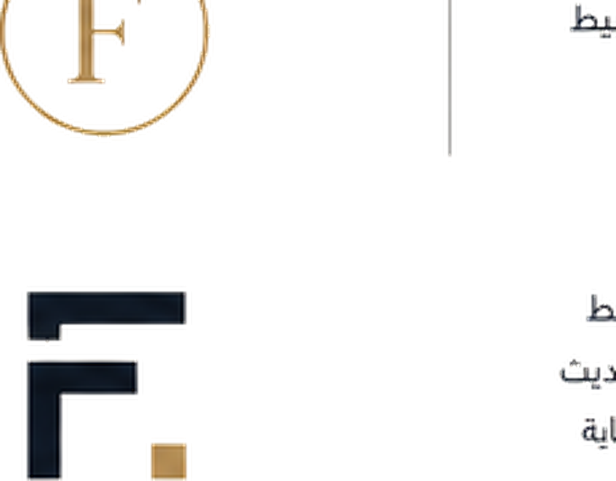

<!doctype html>
<html lang="en" dir="ltr">
<head>
  <meta charset="utf-8">
  <meta name="viewport" content="width=device-width, initial-scale=1">
  <meta name="description" content="Fahad Bedaiwi — Production Engineer. Engineering Better Operations.">
  <title>Fahad Bedaiwi | Engineering Better Operations</title>
  <link rel="icon" href="assets/logo.png">
  <link rel="stylesheet" href="styles.css">
</head>
<body>
  <header class="navbar">
    

    <nav class="navlinks">
      <a href="#about" data-en="About" data-ar="نبذة">About</a>
      <a href="#tools" data-en="Tools" data-ar="الأدوات">Tools</a>
      <a href="#articles" data-en="Articles" data-ar="المقالات">Articles</a>
      <a href="#contact" data-en="Contact" data-ar="تواصل">Contact</a>
    </nav>

    <button id="langToggle" class="lang-toggle">العربية</button>
  </header>

  <main id="top">
    <section class="hero section">
      

        Hi, I'm
        <h1>Fahad Bedaiwi.</h1>
        
Production Engineer.

        
Engineering Better Operations.

        

          <a class="btn btn-primary" href="#tools" data-en="Explore Tools" data-ar="جرّب الأدوات">Explore Tools</a>
          <a class="btn btn-secondary" href="#about" data-en="About Me" data-ar="عن فهد">About Me</a>
        

        <a href="#about" class="scroll-link" data-en="Scroll to discover ↓" data-ar="انزل لتكتشف ↓">Scroll to discover ↓</a>
      

      

        

        
      

    </section>

    <section id="about" class="section alt">
      

        About
        <h2 data-en="More than an engineer." data-ar="أكثر من مجرد مهندس.">More than an engineer.</h2>
      

      

        

          

             I'm Fahad Bedaiwi, a Production Engineer passionate about improving operations, solving real-world problems, and creating practical solutions that make work easier.
          

          

             I built Fahad.help to share useful tools, practical knowledge, and resources that help engineers and professionals make better decisions. I also wanted to create something distinctive that reflects how I think, work, and solve problems.
          

          
This is just the beginning.

        

        

          
<strong>4+</strong>Years of Experience

          
<strong>2</strong>Countries

          
<strong>4</strong>Engineering Roles

          
<strong>40+</strong>Rig Jobs Supported

          
<strong>98%</strong>Data Reliability

          
<strong>7</strong>Free Tools

        

      

    </section>

    <section id="tools" class="section tools-section">
      

        Tools
        <h2 data-en="Built to solve real problems." data-ar="مصممة لحل مشكلات حقيقية.">Built to solve real problems.</h2>
        
Free tools for professionals and engineers.

      

      

        

          🇸🇦
          

            <h3 data-en="Saudi Career Tools" data-ar="أدوات السوق السعودي">Saudi Career Tools</h3>
            
Practical tools designed for professionals working in Saudi Arabia.

          

        

        

          <article class="tool-card">
            ⚖️
            <h4 data-en="Job Offer Comparison" data-ar="مقارنة عرضين وظيفيين">Job Offer Comparison</h4>
            
Compare salary, allowances, bonuses, location, and total annual value.

            <button class="open-tool" data-tool="offer" data-en="Open Tool →" data-ar="فتح الأداة ←">Open Tool →</button>
          </article>

          <article class="tool-card">
            📈
            <h4 data-en="Salary Raise Calculator" data-ar="حاسبة الزيادة">Salary Raise Calculator</h4>
            
Calculate the percentage increase and monthly or annual difference.

            <button class="open-tool" data-tool="raise" data-en="Open Tool →" data-ar="فتح الأداة ←">Open Tool →</button>
          </article>

          <article class="tool-card">
            🚗
            <h4 data-en="Commute Calculator" data-ar="حاسبة التنقل">Commute Calculator</h4>
            
Estimate monthly commute time, fuel usage, and annual cost.

            <button class="open-tool" data-tool="commute" data-en="Open Tool →" data-ar="فتح الأداة ←">Open Tool →</button>
          </article>

          <article class="tool-card">
            🛡️
            <h4 data-en="GOSI Deduction Calculator" data-ar="حاسبة خصم التأمينات">GOSI Deduction Calculator</h4>
            
Calculate the Saudi employee deduction from basic salary and housing allowance based on contribution history and salary month.

            <button class="open-tool" data-tool="gosi" data-en="Open Tool →" data-ar="فتح الأداة ←">Open Tool →</button>
          </article>
        

      

      

        

          🏭
          

            <h3 data-en="Engineering Tools" data-ar="أدوات هندسية">Engineering Tools</h3>
            
Built for production, operations, and continuous improvement.

          

        

        

          <article class="tool-card">
            📊
            <h4>OEE Calculator</h4>
            
Calculate Availability, Performance, Quality, and total OEE.

            <button class="open-tool" data-tool="oee" data-en="Open Tool →" data-ar="فتح الأداة ←">Open Tool →</button>
          </article>

          <article class="tool-card">
            🔍
            <h4 data-en="Root Cause Helper" data-ar="مساعد تحليل السبب الجذري">Root Cause Helper</h4>
            
Structure the problem, 5 Whys, possible causes, and next actions.

            <button class="open-tool" data-tool="root" data-en="Open Tool →" data-ar="فتح الأداة ←">Open Tool →</button>
          </article>

          <article class="tool-card">
            📝
            <h4 data-en="Shift Handover" data-ar="تسليم الشفت">Shift Handover</h4>
            
Create a clear handover report for production, issues, and actions.

            <button class="open-tool" data-tool="shift" data-en="Open Tool →" data-ar="فتح الأداة ←">Open Tool →</button>
          </article>

          <article class="tool-card">
            📉
            <h4 data-en="KPI Dashboard" data-ar="لوحة مؤشرات الأداء">KPI Dashboard</h4>
            
Review production, downtime, rejects, and operational efficiency.

            <button class="open-tool" data-tool="kpi" data-en="Open Tool →" data-ar="فتح الأداة ←">Open Tool →</button>
          </article>
        

      

    </section>

    <section id="articles" class="section alt">
      

        Articles
        <h2 data-en="Simple ideas. Practical value." data-ar="أفكار بسيطة. قيمة عملية.">Simple ideas. Practical value.</h2>
      

      

        <article class="article-card">
          01
          <h3 data-en="How to Compare Two Job Offers" data-ar="كيف تقارن بين عرضين وظيفيين">How to Compare Two Job Offers</h3>
          
The right offer is more than salary. Compare allowances, bonuses, commute, stability, growth, and the complete annual package before deciding.

        </article>

        <article class="article-card">
          02
          <h3 data-en="What Is OEE?" data-ar="ما هو OEE؟">What Is OEE?</h3>
          
A practical introduction to Availability, Performance, Quality, and the operational losses that quietly reduce production results.

        </article>

        <article class="article-card">
          03
          <h3 data-en="Small Improvements Matter" data-ar="التحسينات الصغيرة تصنع فرقًا">Small Improvements Matter</h3>
          
Consistent small improvements can create stronger long-term results than one major change, especially when the team measures and repeats what works.

        </article>
      

    </section>

    <section class="section roadmap">
      

        Roadmap
        <h2 data-en="What's next." data-ar="ما القادم.">What's next.</h2>
      

      

        Recruiter Challenge
        Interview Toolkit
        Templates Library
        AI Assistant
      

    </section>

    <section id="contact" class="section contact-section">
      

        Contact
        <h2 data-en="Let's connect." data-ar="خلنا نتواصل.">Let's connect.</h2>
        
For opportunities, collaborations, or a quick professional conversation.

        

          <a class="btn btn-primary" href="mailto:contact@fahad.help" data-en="Email" data-ar="إيميل">Email</a>
          <a class="btn btn-secondary" href="https://www.linkedin.com/in/fahad-bedaiwi" target="_blank" rel="noreferrer">LinkedIn</a>
          <a class="btn btn-secondary" href="https://wa.me/966507717174?text=Hi%20Fahad%2C%20I%20found%20your%20website%20and%20would%20like%20to%20connect." target="_blank" rel="noreferrer">WhatsApp</a>
        

      

    </section>
  </main>

  <footer>
    
    

      <strong>Fahad Bedaiwi</strong>
      Engineering Better Operations.
    

    <small>©  fahad.help</small>
  </footer>

  <dialog id="toolDialog">
    <button class="close-dialog" aria-label="Close">×</button>
    

  </dialog>

  
</body>
</html>
